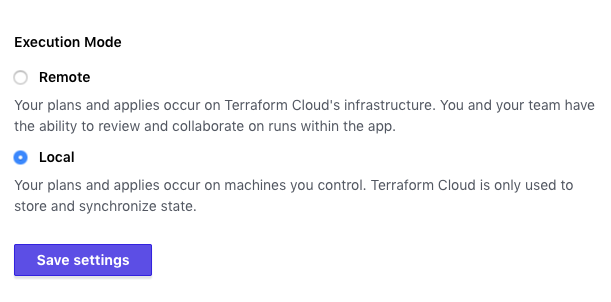
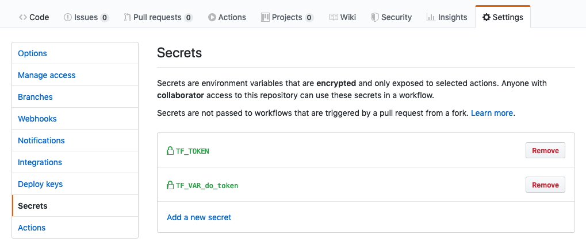

Terraform is a tool for building, changing, and versioning infrastructure safely and efficiently. Terraform can manage existing and popular service providers as well as custom in-house solutions.

Configuration files describe to Terraform the components needed to run a single application or your entire datacenter. Terraform generates an execution plan describing what it will do to reach the desired state, and then executes it to build the described infrastructure. As the configuration changes, Terraform is able to determine what changed and create incremental execution plans which can be applied. For more information go [here](https://www.terraform.io/intro/index.html).

However if you are familiar with terraform you already know that without a remote state it quickly becomes cumbersome to share the state of your infrastructure and guarantee consistency between plan executions.

In this tutorial we will see how you can use [github actions](https://github.com/features/actions) and [terraform cloud](https://www.terraform.io/) to build a infrastructure and deploy changes without worrying about your terraform state.

#### Step 1 - Register with Terraform Cloud
If you haven't already, get a account with [terraform](https://www.terraform.io/) - it's free. Follow the instructions and setup your organization and your first workspace. Next we need to obtain a token for that workspace which we are going to use later.


>> terraform login
Terraform will request an API token for app.terraform.io using your browser.

If login is successful, Terraform will store the token in plain text in
the following file for use by subsequent commands:
    /Users/You/.terraform.d/credentials.tfrc.json

Do you want to proceed? (y/n)


Follow the instructions and paste the token into the command line. So far so good, we are setup. Now we are good to go and build our first terraform infrastructure.

#### Step 2 - Create your terraform plan
We are going to use a very simple terraform plan to demonstrate this setup - for more information on what can be done with terraform checkout the [guides](https://learn.hashicorp.com/terraform). 

> mkdir terraform-github-actions
> cd !$
> vi infrastructure.tf


Next we are going to tell terraform to use a remote backed to manage the state of our infrastructure.


terraform {
  backend "remote" {
    hostname     = "app.terraform.io"
    organization = "<your-org-name>"

    workspaces {
      name = "terraform-github-actions"
    }
  }
}


Now we are ready to initialize our new remote state.


> terraform init


When the command succeeded go back to your [terraform](https://www.terraform.io/) account and go to general setting of your workspace and mark the state as local. This allows us to use it in CI/CD.

#### Step 3 - Adding a provider and resources.
Now we are ready to tell terraform what resources we want to create and where. For this demonstration we are going to use a simple lamp stack and deploy changes to one of the HTML files. 


variable do_token {}

provider "digitalocean" {
  token = var.do_token
}

# create a new private key
resource "tls_private_key" "ssh_key" {
  algorithm = "RSA"
}

# add the public part to digital ocean
resource "digitalocean_ssh_key" "deployer" {
  name       = "Deployer"
  public_key = tls_private_key.ssh_key.public_key_openssh
}

resource "digitalocean_droplet" "server" {
  image              = "lamp-18-04"
  name               = "my-server"
  private_networking = false
  region             = "fra1"
  size               = "s-1vcpu-2gb"
  # the service will only be accessible with this key.
  ssh_keys = [digitalocean_ssh_key.deployer.fingerprint]
}


One neat thing worth mentioning is that the `ssh key` to access the server is never know to us it's only part of the encrypted remote state.
We could even rotate those keys by using `terraform taint tls_private_key.ssh_key` and put that into a [scheduled github action](https://help.github.com/en/actions/reference/workflow-syntax-for-github-actions#onschedule) - so easy. 

Now verify everything is correct by validating and outputting the execution plan.

> terraform init # again because now terraform will download the provider plugins
> terraform validate
> TF_VAR_do_token=<do_token> terraform plan


#### Step 3 - The null_provider or how to always deploy via remote_exec

Before we get into how the `null_provider` can be used to provision our server, I need to state that there are better ways to do what we are going to do.
We might want to invoke `chef` or `puppet` to do our provisioning. Also we could build our release as image with `packer` and deploy a new `droplet` each time. 

But let's suppose, hypothetically, there is no way around using ssh to `remote_exec` into the machine to do a `git pull`. Here is how we could go about this.


resource "null_resource" "deploy" {
  triggers = {
    # wait until the `server` resource is available
    public_ip = digitalocean_droplet.server.ipv4_address
    # force a stale resource
    always_run = "${timestamp()}"
  }

  connection {
    type        = "ssh"
    host        = digitalocean_droplet.server.ipv4_address
    user        = "root"
    private_key = tls_private_key.ssh_key.private_key_pem
  }

  provisioner "remote-exec" {
    inline = [
      # Whatever command you like
      "echo `date` >> /var/www/html/deploy.html ",
      "echo done",
    ]
  }



The line `always_run = "${timestamp()}"` forces terraform to always execute this block. 
We are going to use this fact to update our `server` on each commit with github actions.

#### Step 4 - Create a repository and CI in github

Next we want to automate the execution on each `git push` using github actions. But first we need create the actual repository and the necessary secrets under the settings tab. First `TF_VAR_do_token` which should hold your digital ocean token. And second we are going to need the terraform token for your workspace.
Grab it with and put in a secret named `TF_TOKEN`.


> cat  /Users/You/.terraform.d/credentials.tfrc.json
{
  "credentials": {
    "app.terraform.io": {
      "token": "<TF_TOKEN>" # Your token
    }
  }
}

The result should look like this.

Now we can create a workflow as follows:

> mkdir -p .github/workflows
> vi .github/workflows/deploy.tf



name: Continuous Integration
# This workflow is triggered on pushes to the repository.
on:
  push:
    branches:
      - master
env:
  tf_version: "latest"
  tf_working_dir: "./"
  tf_token: ${{ secrets.TF_TOKEN }}
  TF_VAR_do_token: ${{ secrets.TF_VAR_do_token }}

jobs:
  terraform:
    name: "Terraform"
    runs-on: ubuntu-latest
    steps:
      - name: "Checkout"
        uses: actions/checkout@master

      - name: "Terraform Init"
        uses: hashicorp/terraform-github-actions@master
        with:
          tf_actions_version: ${{ env.tf_version }}
          tf_actions_working_dir: ${{ env.tf_working_dir }}
          tf_actions_cli_credentials_token: ${{ env.tf_token }}
          tf_actions_subcommand: "init"

      - name: "Terraform Validate"
        uses: hashicorp/terraform-github-actions@master
        with:
          tf_actions_version: ${{ env.tf_version }}
          tf_actions_working_dir: ${{ env.tf_working_dir }}
          tf_actions_cli_credentials_token: ${{ env.tf_token }}
          tf_actions_subcommand: "validate"

      - name: "Terraform Apply"
        uses: hashicorp/terraform-github-actions@master
        with:
          tf_actions_version: ${{ env.tf_version }}
          tf_actions_working_dir: ${{ env.tf_working_dir }}
          tf_actions_cli_credentials_token: ${{ env.tf_token }}
          tf_actions_subcommand: "apply"



This basically does `init`, `validate`, `apply` in order - and since we use the `null_provider` it will always execute our deployment.
Next we need to check in all changes to create our workflow or action. 


> git remote add origin git@github.com:<YOU>/terraform-github-actions.git
> echo ".terraform" >> .gitignore
> git add .github/ infrastructure.tf .gitignore
> git commit -m"Initial commit" && git push


Now watch your pipeline succeed and do the following locally to verify it works


> terraform show | grep ipv4
    ipv4_address       = "161.111.111.111"
> curl http://161.111.111.111/deploy.html
> Mon Apr 6 14:22:42 UTC 2020


Done - that's it, I hope you liked it and you found something useful to implement or copy.

Best, 
Kai